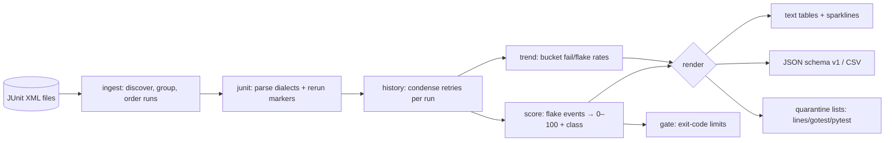

# flakesift

[English](README.md) | [中文](README.zh.md) | [日本語](README.ja.md)

[](LICENSE) [](go.mod) [](CHANGELOG.md)  [](CONTRIBUTING.md)

**flakesift：素の JUnit XML 履歴からテストの flaky 度をスコアリングするオープンソース・依存ゼロの CLI——隔離リスト、トレンド、CI ゲートを、どのテストランナーも既に書き出しているアーティファクトから生成する。**


```bash
git clone https://github.com/JaydenCJ/flakesift && cd flakesift
go build -o flakesift ./cmd/flakesift    # single static binary, stdlib only
```

> プレリリース注記：v0.1.0 はまだどのパッケージレジストリにも公開されていません。上記の手順でソースからビルドしてください（Go ≥1.22 で可）。

## なぜ flakesift？

Flaky テストは毎年 CI の不満ランキングの頂点に立ち、ツール業界の答えは「ダッシュボードを買え」になってしまった。CircleCI も Datadog も BuildPulse も flake を検出する——ただし*自社*プラットフォームで走るビルドだけ、*自社* agent 経由のアップロードだけ、*自社*のシート課金で。しかし真実のデータはベンダー中立で、すでにあなたのディスクにある：JUnit XML、あらゆるランナー（pytest、Maven、Gradle、Jest、go-junit-report）が吐き出すあのフォーマットだ。flakesift はそのファイルの入ったフォルダをオフラインで読み、ダッシュボードが計算するものを計算する：実行間の判定フリップと実行内リトライ回復（Maven Surefire の `flakyFailure` マーカー含む）から組み立てたテストごとの 0–100 flaky スコア、*flaky* と*常時失敗*を決して混同しない分類、`go test -skip` や pytest `-k` にそのまま貼れる隔離リスト、sparkline トレンド、flake 数が増えたら終了コード 1 で落ちる `gate` コマンド。アカウント不要、アップロード不要、ロックインなし——CI がアーティファクトフォルダを保存できるなら、flakesift はそれをスコアリングできる。

| | flakesift | CI ベンダーの flake 検出 | 有料 flake ダッシュボード | 赤いビルドを目 grep |
|---|---|---|---|---|
| 入力 | 任意ランナーの素の JUnit XML | 自社プラットフォームのビルドのみ | 自社 agent のアップロードのみ | 生ログ |
| オフラインで過去アーティファクトを処理 | ✅ | ❌ SaaS | ❌ SaaS | ✅ |
| リトライに隠れた flake の検出（実行内回復） | ✅ | 部分的 | ✅ | ❌ |
| broken（常時失敗）と flaky の区別 | ✅ | ❌ | 製品による | ❌ |
| `go test` / pytest 向け隔離出力 | ✅ | ❌ | ❌ | ❌ |
| パイプライン向け終了コードゲート | ✅ | ❌ | ❌ | ❌ |
| コスト / ランタイム依存 | 無料 / 0 | プラットフォーム課金 | シート課金 | 無料 |

<sub>依存数は 2026-07-13 に確認：flakesift が import するのは Go 標準ライブラリのみ。`go.mod` に require ディレクティブは一つもない。</sub>

## 特徴

- **手元にあるものをそのまま読む** — JUnit XML のフォルダを指すだけ。testsuites ルートも裸の testsuite も、ネストもフラットも、pytest 方言も Surefire 方言も設定なしでパース。同じフォルダの異種 XML（カバレッジレポート）はエラーにせずスキップ。
- **説明可能なスコアリング** — スコアは直接的な flake 証拠が出た実行の割合そのもの：前回実行からの判定フリップ、またはリトライによる救済。一文で説明でき、ML なし。完全なドキュメントは [docs/scoring.md](docs/scoring.md)。
- **リトライに隠れた flake を暴く** — リトライプラグインの再実行で「常にパス」しているテストは 100 点になる。証拠は重複した `<testcase>` 試行でも Surefire の `<flakyFailure>` マーカーでもよい。
- **Broken ≠ flaky** — 100% 失敗するテストは決定的であり、専用のクラスを持つ。`quarantine` は明示的にオプトインしない限りそれを隠さないので、本物のバグが埋もれない。
- **ツールがそのまま食える隔離リスト** — プレーン行リスト、JSON、アンカー付き `go test -skip` 正規表現、pytest `-k` 除外式。
- **CI のためのトレンドとゲート** — バケット化した履歴上の sparkline 失敗率/flake 率、そして `--max-flaky` / `--max-broken` 上限を超えたら終了コード 1 で落ちる `gate` コマンド。
- **依存ゼロ・完全オフライン・決定的** — Go 標準ライブラリのみ、ネットワークなし、テレメトリなし。同一入力はバイト単位で同一の出力を生む。

## クイックスタート

```bash
# fabricate a deterministic 20-run history (or use your own CI artifacts)
bash examples/make-history.sh ci-history
./flakesift score ci-history
```

実際にキャプチャした出力：

```text
flakesift score — 20 runs, 5 tests

score  class    runs  fail%  flips  retries  last  test
 95.0  flaky      20   50.0     19        0  fail  orders.CartTest::testCheckoutRace
 30.0  flaky      20    0.0      0        6  pass  auth.SessionTest::testLoginRetry
  5.0  suspect    20   30.0      1        0  fail  billing.InvoiceTest::testRounding
  0.0  broken     20  100.0      0        0  fail  search.IndexTest::testMigration
  0.0  healthy    20    0.0      0        0  pass  search.IndexTest::testTokenize
```

中段の行に注目：`testLoginRetry` は一度も実行を失敗させていない——6 回の
リトライ回復こそが flaky の理由——一方 `testRounding` は実行の 30% で失敗
しつつフリップは 1 回だけ（揺らぎではなく本物のリグレッション）、常に赤い
`testMigration` は flaky ではなく *broken*。次はスイート全体のトレンドを見てみる（実出力）：

```text
$ ./flakesift trend --buckets 5 ci-history
flakesift trend — 20 runs in 5 buckets

fail rate   ▅▅▅▇█  (max 50.0%)
flake rate  ▆▇██▇  (max 30.0%)

bucket  runs  execs  fails  flakes  fail%  flake%  span
     1     4     20      6       4   30.0    20.0  ci-history/run-001.xml … ci-history/run-004.xml
     2     4     20      6       5   30.0    25.0  ci-history/run-005.xml … ci-history/run-008.xml
     3     4     20      6       6   30.0    30.0  ci-history/run-009.xml … ci-history/run-012.xml
     4     4     20      8       6   40.0    30.0  ci-history/run-013.xml … ci-history/run-016.xml
     5     4     20     10       5   50.0    25.0  ci-history/run-017.xml … ci-history/run-020.xml
```

スキップパターンを生成し、CI で一線を守る（実出力、終了コード 1）：

```text
$ ./flakesift quarantine --format gotest ci-history
^(testCheckoutRace|testLoginRetry)$

$ ./flakesift gate --max-flaky 1 ci-history
flaky      2  (limit 1)  BREACH
broken     1  (ignored)  ok
gate: FAIL
```

## CLI リファレンス

`flakesift [score|quarantine|trend|gate|runs|version] [flags] <dir|files…>`——裸のパスは `score` にデフォルトする。終了コード：0 正常、1 ゲート超過、2 使用法エラー、3 実行時エラー。

| フラグ | デフォルト | 効果 |
|---|---|---|
| `--group` | `file` | 実行のグループ化：XML `file` ごとに 1 実行、または `dir` ごと（シャード分割アーティファクト） |
| `--threshold` | `30` | このスコア以上で flaky に分類 |
| `--min-runs` | `3` | 分類に必要な最小実行回数 |
| `--half-life` | `0` | 実行数で測る新しさの半減期；0 = 均一重み |
| `--format` (score) | `text` | `text`、`json`、`csv` |
| `--top` / `--min-score` (score) | 全件 | 行数制限 / 低スコアを隠す |
| `--format` (quarantine) | `lines` | `lines`、`json`、`gotest`、`pytest` |
| `--include-broken` (quarantine) | オフ | 常時失敗テストも隔離に含める |
| `--buckets` / `--test` (trend) | `10` / — | バケット数 / 部分文字列フィルタ |
| `--max-flaky` / `--max-broken` (gate) | `0` / `-1` | 上限；`-1` は broken テストを無視 |

## クラス

| クラス | 意味 | 推奨アクション |
|---|---|---|
| `flaky` | スコア ≥ しきい値：非決定的 | 隔離してからレースを直す |
| `broken` | 全実行で失敗、一度も回復せず | 今すぐ直す——隠さない |
| `suspect` | 失敗かリトライあり、しきい値未満 | 監視；新しいリグレッションのことが多い |
| `healthy` | 失敗もリトライも一度もなし | 何もしない |
| `new` | 実行回数が `--min-runs` 未満 | 履歴が増えるのを待つ |

## 検証

このリポジトリは CI を同梱しない。上記の主張はすべてローカル実行で検証される：

```bash
go test ./...            # 90 deterministic tests, offline, < 5 s
bash scripts/smoke.sh    # end-to-end CLI check, prints SMOKE OK
```

## アーキテクチャ



## ロードマップ

- [x] v0.1.0 — 多方言 JUnit パース、実行のグループ化/順序付け、リトライ対応の履歴、新しさ加重つき説明可能スコアリング、quarantine/trend/gate/runs サブコマンド、90 テスト + smoke スクリプト
- [ ] `diff` サブコマンド：2 つの履歴を比較し、隔離や修正が本当に効いたかを証明
- [ ] monorepo のオーナー振り分けのための suite / ディレクトリ単位の集計
- [ ] 失敗メッセージのクラスタリングで flake を推定根本原因ごとにグループ化
- [ ] 同じモデルの下でのオプションの TRX / Allure 入力アダプタ
- [ ] PR コメント用の Markdown レポート形式

完全なリストは [open issues](https://github.com/JaydenCJ/flakesift/issues) を参照。

## コントリビュート

Issue・議論・PR を歓迎——ローカルワークフロー（フォーマット、vet、テスト、`SMOKE OK`）は [CONTRIBUTING.md](CONTRIBUTING.md) を参照。入門タスクには [good first issue](https://github.com/JaydenCJ/flakesift/issues?q=is%3Aissue+is%3Aopen+label%3A%22good+first+issue%22) のラベルがあり、設計の議論は [Discussions](https://github.com/JaydenCJ/flakesift/discussions) で。

## ライセンス

[MIT](LICENSE)
