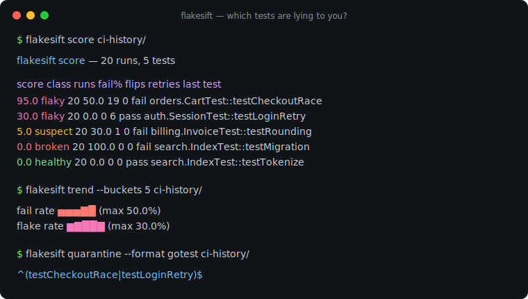
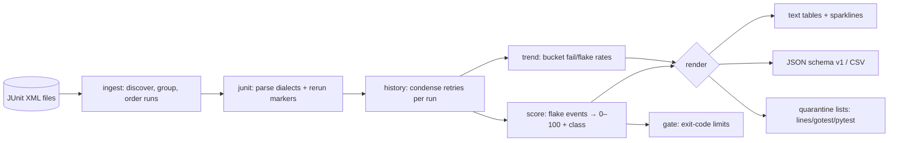

# flakesift

[English](README.md) | [中文](README.zh.md) | [日本語](README.ja.md)

[](LICENSE) [](go.mod) [](CHANGELOG.md)  [](CONTRIBUTING.md)

**flakesift：an open-source, zero-dependency CLI that scores test flakiness from plain JUnit XML history — quarantine lists, trends, and CI gates from the artifacts every test runner already writes.**



```bash
git clone https://github.com/JaydenCJ/flakesift && cd flakesift
go build -o flakesift ./cmd/flakesift    # single static binary, stdlib only
```

> Pre-release: v0.1.0 is not tagged on a package registry yet; build from source as above (any Go ≥1.22).

## Why flakesift?

Flaky tests top every CI complaint survey, and the tooling answer has become "buy a dashboard": CircleCI, Datadog, and BuildPulse all detect flakes — for builds that run on *their* platform, uploaded through *their* agent, priced per *their* seat. But the ground truth is vendor-neutral and already on your disk: JUnit XML, the one format every runner (pytest, Maven, Gradle, Jest, go-junit-report) emits. flakesift reads a folder of those files offline and computes what the dashboards compute: a 0–100 flakiness score per test built from run-to-run verdict flips and in-run retry recoveries (including Maven Surefire's `flakyFailure` markers), a classification that refuses to confuse *flaky* with *always-failing*, quarantine lists ready to paste into `go test -skip` or pytest `-k`, sparkline trends, and a `gate` command that exits 1 when the flake count grows. No account, no upload, no lock-in — if your CI can archive an artifact folder, flakesift can score it.

| | flakesift | CI-vendor flake detection | paid flake dashboards | grepping red builds |
|---|---|---|---|---|
| Input | plain JUnit XML from any runner | own platform's builds only | own agent's uploads only | raw logs |
| Works offline, on historical artifacts | ✅ | ❌ SaaS | ❌ SaaS | ✅ |
| Retry-masked flake detection (in-run recoveries) | ✅ | partial | ✅ | ❌ |
| Distinguishes broken (always-failing) from flaky | ✅ | ❌ | varies | ❌ |
| Quarantine output for `go test` / pytest | ✅ | ❌ | ❌ | ❌ |
| Exit-code gate for pipelines | ✅ | ❌ | ❌ | ❌ |
| Cost / runtime dependencies | free / 0 | platform pricing | per-seat | free |

<sub>Dependency count checked 2026-07-13: flakesift imports the Go standard library only; `go.mod` has no require directives.</sub>

## Features

- **Reads what you already have** — point it at a folder of JUnit XML files; suites root or bare, nested or flat, pytest or Surefire dialect, all parsed without configuration. Foreign XML (coverage reports) in the same folder is skipped, not fatal.
- **Explainable scoring** — the score is simply the share of runs showing direct flake evidence: a verdict flip versus the previous run, or a retry that rescued the run. One sentence, no ML, fully documented in [docs/scoring.md](docs/scoring.md).
- **Retry-masked flakes surface** — a test that "always passes" because a retry plugin re-runs it scores 100, from either repeated `<testcase>` attempts or Surefire's `<flakyFailure>` markers.
- **Broken ≠ flaky** — a test failing 100% of runs is deterministic and gets its own class; `quarantine` refuses to hide it unless you opt in, so real bugs don't get buried.
- **Quarantine lists tools can eat** — plain lines, JSON, an anchored `go test -skip` regexp, or a pytest `-k` deselect expression.
- **Trends and gates for CI** — sparkline fail/flake rates over bucketed history, and a `gate` command with `--max-flaky` / `--max-broken` limits that exits 1 on breach.
- **Zero dependencies, fully offline, deterministic** — Go standard library only, no network, no telemetry; identical input produces byte-identical output.

## Quickstart

```bash
# fabricate a deterministic 20-run history (or use your own CI artifacts)
bash examples/make-history.sh ci-history
./flakesift score ci-history
```

Real captured output:

```text
flakesift score — 20 runs, 5 tests

score  class    runs  fail%  flips  retries  last  test
 95.0  flaky      20   50.0     19        0  fail  orders.CartTest::testCheckoutRace
 30.0  flaky      20    0.0      0        6  pass  auth.SessionTest::testLoginRetry
  5.0  suspect    20   30.0      1        0  fail  billing.InvoiceTest::testRounding
  0.0  broken     20  100.0      0        0  fail  search.IndexTest::testMigration
  0.0  healthy    20    0.0      0        0  pass  search.IndexTest::testTokenize
```

Note the middle rows: `testLoginRetry` never failed a run — its 6 retry
recoveries are what make it flaky — while `testRounding` fails 30% of runs
but flipped only once (a real regression, not churn), and the always-red
`testMigration` is *broken*, not flaky. Now ask how the whole suite is trending (real output):

```text
$ ./flakesift trend --buckets 5 ci-history
flakesift trend — 20 runs in 5 buckets

fail rate   ▅▅▅▇█  (max 50.0%)
flake rate  ▆▇██▇  (max 30.0%)

bucket  runs  execs  fails  flakes  fail%  flake%  span
     1     4     20      6       4   30.0    20.0  ci-history/run-001.xml … ci-history/run-004.xml
     2     4     20      6       5   30.0    25.0  ci-history/run-005.xml … ci-history/run-008.xml
     3     4     20      6       6   30.0    30.0  ci-history/run-009.xml … ci-history/run-012.xml
     4     4     20      8       6   40.0    30.0  ci-history/run-013.xml … ci-history/run-016.xml
     5     4     20     10       5   50.0    25.0  ci-history/run-017.xml … ci-history/run-020.xml
```

Emit a skip pattern and hold the line in CI (real output, exit code 1):

```text
$ ./flakesift quarantine --format gotest ci-history
^(testCheckoutRace|testLoginRetry)$

$ ./flakesift gate --max-flaky 1 ci-history
flaky      2  (limit 1)  BREACH
broken     1  (ignored)  ok
gate: FAIL
```

## CLI reference

`flakesift [score|quarantine|trend|gate|runs|version] [flags] <dir|files…>` — a bare path defaults to `score`. Exit codes: 0 ok, 1 gate breach, 2 usage error, 3 runtime error.

| Flag | Default | Effect |
|---|---|---|
| `--group` | `file` | run grouping: one run per XML `file`, or per `dir` (sharded artifacts) |
| `--threshold` | `30` | score at or above which a test is classified flaky |
| `--min-runs` | `3` | executions required before a test is classified at all |
| `--half-life` | `0` | recency half-life in runs; 0 = uniform weighting |
| `--format` (score) | `text` | `text`, `json`, or `csv` |
| `--top` / `--min-score` (score) | all | limit rows / hide low scores |
| `--format` (quarantine) | `lines` | `lines`, `json`, `gotest`, or `pytest` |
| `--include-broken` (quarantine) | off | also quarantine always-failing tests |
| `--buckets` / `--test` (trend) | `10` / — | bucket count / substring filter |
| `--max-flaky` / `--max-broken` (gate) | `0` / `-1` | limits; `-1` ignores broken tests |

## Classes

| Class | Meaning | Suggested action |
|---|---|---|
| `flaky` | score ≥ threshold: nondeterministic | quarantine, then fix the race |
| `broken` | failed every execution, never recovered | fix now — do not hide |
| `suspect` | failed or retried, below threshold | watch; often a fresh regression |
| `healthy` | never failed, never retried | nothing |
| `new` | fewer than `--min-runs` executions | wait for more history |

## Verification

This repository ships no CI; every claim above is verified by local runs:

```bash
go test ./...            # 90 deterministic tests, offline, < 5 s
bash scripts/smoke.sh    # end-to-end CLI check, prints SMOKE OK
```

## Architecture



## Roadmap

- [x] v0.1.0 — multi-dialect JUnit parsing, run grouping/ordering, retry-aware history, explainable scoring with recency weighting, quarantine/trend/gate/runs subcommands, 90 tests + smoke script
- [ ] `diff` subcommand: compare two histories to prove a quarantine or fix actually helped
- [ ] Per-suite and per-directory rollups for monorepo ownership routing
- [ ] Failure-message clustering to group flakes by probable root cause
- [ ] Optional TRX and Allure input adapters behind the same model
- [ ] Markdown report format for PR comments

See the [open issues](https://github.com/JaydenCJ/flakesift/issues) for the full list.

## Contributing

Issues, discussions and pull requests are welcome — see [CONTRIBUTING.md](CONTRIBUTING.md) for the local workflow (format, vet, tests, `SMOKE OK`). Good entry points are labelled [good first issue](https://github.com/JaydenCJ/flakesift/issues?q=is%3Aissue+is%3Aopen+label%3A%22good+first+issue%22), and design questions live in [Discussions](https://github.com/JaydenCJ/flakesift/discussions).

## License

[MIT](LICENSE)
