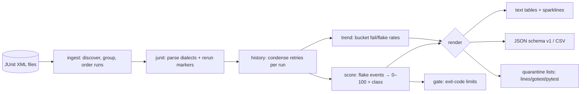

# flakesift

[English](README.md) | [中文](README.zh.md) | [日本語](README.ja.md)

[](LICENSE) [](go.mod) [](CHANGELOG.md)  [](CONTRIBUTING.md)

**flakesift：开源、零依赖的 CLI，从普通 JUnit XML 历史中为测试的 flaky 程度打分——隔离清单、趋势曲线、CI 门禁，全部来自每个测试运行器本来就在写的产物文件。**


```bash
git clone https://github.com/JaydenCJ/flakesift && cd flakesift
go build -o flakesift ./cmd/flakesift    # single static binary, stdlib only
```

> 预发布提示：v0.1.0 尚未发布到任何包仓库；请按上面的方式从源码构建（Go ≥1.22 即可）。

## 为什么选 flakesift？

Flaky 测试年年霸榜 CI 抱怨清单，而工具界的答案变成了"买个仪表盘"：CircleCI、Datadog、BuildPulse 都能检测 flake——但只针对跑在*它们*平台上的构建、经*它们*的 agent 上传、按*它们*的席位计费。可事实的真相是厂商中立的，而且早就躺在你的磁盘上：JUnit XML，每个运行器（pytest、Maven、Gradle、Jest、go-junit-report）都会输出的那个格式。flakesift 离线读取一个装满这些文件的文件夹，算出仪表盘算的那些东西：基于跨运行判定翻转与运行内重试恢复（含 Maven Surefire 的 `flakyFailure` 标记）的每测试 0–100 flaky 分数、绝不把 *flaky* 和*一直失败*混为一谈的分类、可直接粘进 `go test -skip` 或 pytest `-k` 的隔离清单、sparkline 趋势，以及在 flake 数量增长时以退出码 1 失败的 `gate` 命令。不用注册、不用上传、没有锁定——只要你的 CI 能归档一个产物文件夹，flakesift 就能为它打分。

| | flakesift | CI 厂商 flake 检测 | 付费 flake 仪表盘 | 肉眼 grep 红色构建 |
|---|---|---|---|---|
| 输入 | 任意运行器的普通 JUnit XML | 仅限自家平台的构建 | 仅限自家 agent 的上传 | 原始日志 |
| 离线工作、可处理历史产物 | ✅ | ❌ SaaS | ❌ SaaS | ✅ |
| 检测被重试掩盖的 flake（运行内恢复） | ✅ | 部分 | ✅ | ❌ |
| 区分 broken（一直失败）与 flaky | ✅ | ❌ | 视产品而定 | ❌ |
| 面向 `go test` / pytest 的隔离输出 | ✅ | ❌ | ❌ | ❌ |
| 面向流水线的退出码门禁 | ✅ | ❌ | ❌ | ❌ |
| 成本 / 运行时依赖 | 免费 / 0 | 平台定价 | 按席位 | 免费 |

<sub>依赖数核对于 2026-07-13：flakesift 只 import Go 标准库；`go.mod` 没有任何 require 指令。</sub>

## 特性

- **读你手头已有的东西** — 指向一个 JUnit XML 文件夹即可；suites 根或裸 testsuite、嵌套或扁平、pytest 或 Surefire 方言，全部零配置解析。同文件夹里的异类 XML（覆盖率报告）会被跳过而非报错。
- **可解释的打分** — 分数就是出现直接 flake 证据的运行占比：判定相对上次运行翻转，或一次重试挽救了本次运行。一句话讲完，没有 ML，完整文档见 [docs/scoring.md](docs/scoring.md)。
- **揪出被重试掩盖的 flake** — 因为重试插件反复重跑而"一直通过"的测试会得 100 分，无论证据来自重复的 `<testcase>` 尝试还是 Surefire 的 `<flakyFailure>` 标记。
- **Broken ≠ flaky** — 100% 失败的测试是确定性的，拥有自己的类别；`quarantine` 默认拒绝隐藏它，除非显式选择加入，真正的 bug 不会被埋掉。
- **工具能直接吃下的隔离清单** — 纯行清单、JSON、锚定的 `go test -skip` 正则，或 pytest `-k` 反选表达式。
- **面向 CI 的趋势与门禁** — 分桶历史上的 sparkline 失败率/flake 率，以及带 `--max-flaky` / `--max-broken` 上限、超限即退出码 1 的 `gate` 命令。
- **零依赖、完全离线、确定性** — 仅 Go 标准库，无网络，无遥测；相同输入产生逐字节相同的输出。

## 快速上手

```bash
# fabricate a deterministic 20-run history (or use your own CI artifacts)
bash examples/make-history.sh ci-history
./flakesift score ci-history
```

真实捕获的输出：

```text
flakesift score — 20 runs, 5 tests

score  class    runs  fail%  flips  retries  last  test
 95.0  flaky      20   50.0     19        0  fail  orders.CartTest::testCheckoutRace
 30.0  flaky      20    0.0      0        6  pass  auth.SessionTest::testLoginRetry
  5.0  suspect    20   30.0      1        0  fail  billing.InvoiceTest::testRounding
  0.0  broken     20  100.0      0        0  fail  search.IndexTest::testMigration
  0.0  healthy    20    0.0      0        0  pass  search.IndexTest::testTokenize
```

注意中间几行：`testLoginRetry` 从没让任何运行失败——正是那 6 次重试
恢复让它成为 flaky——而 `testRounding` 虽有 30% 的运行失败却只翻转过一次
（是真回归，不是抖动），一直全红的 `testMigration` 属于 *broken*，
不是 flaky。再看整个套件的趋势走向（真实输出）：

```text
$ ./flakesift trend --buckets 5 ci-history
flakesift trend — 20 runs in 5 buckets

fail rate   ▅▅▅▇█  (max 50.0%)
flake rate  ▆▇██▇  (max 30.0%)

bucket  runs  execs  fails  flakes  fail%  flake%  span
     1     4     20      6       4   30.0    20.0  ci-history/run-001.xml … ci-history/run-004.xml
     2     4     20      6       5   30.0    25.0  ci-history/run-005.xml … ci-history/run-008.xml
     3     4     20      6       6   30.0    30.0  ci-history/run-009.xml … ci-history/run-012.xml
     4     4     20      8       6   40.0    30.0  ci-history/run-013.xml … ci-history/run-016.xml
     5     4     20     10       5   50.0    25.0  ci-history/run-017.xml … ci-history/run-020.xml
```

生成跳过模式，并在 CI 里守住底线（真实输出，退出码 1）：

```text
$ ./flakesift quarantine --format gotest ci-history
^(testCheckoutRace|testLoginRetry)$

$ ./flakesift gate --max-flaky 1 ci-history
flaky      2  (limit 1)  BREACH
broken     1  (ignored)  ok
gate: FAIL
```

## CLI 参考

`flakesift [score|quarantine|trend|gate|runs|version] [flags] <dir|files…>`——裸路径默认执行 `score`。退出码：0 正常，1 门禁超限，2 用法错误，3 运行时错误。

| 标志 | 默认值 | 作用 |
|---|---|---|
| `--group` | `file` | 运行分组：每个 XML `file` 一个运行，或每个 `dir` 一个（分片产物） |
| `--threshold` | `30` | 达到或超过该分数即归类为 flaky |
| `--min-runs` | `3` | 参与分类前所需的最少执行次数 |
| `--half-life` | `0` | 以运行数计的近期性半衰期；0 = 均匀加权 |
| `--format` (score) | `text` | `text`、`json` 或 `csv` |
| `--top` / `--min-score` (score) | 全部 | 限制行数 / 隐藏低分 |
| `--format` (quarantine) | `lines` | `lines`、`json`、`gotest` 或 `pytest` |
| `--include-broken` (quarantine) | 关 | 把一直失败的测试也纳入隔离 |
| `--buckets` / `--test` (trend) | `10` / — | 桶数量 / 子串过滤 |
| `--max-flaky` / `--max-broken` (gate) | `0` / `-1` | 上限；`-1` 表示忽略 broken 测试 |

## 类别

| 类别 | 含义 | 建议动作 |
|---|---|---|
| `flaky` | 分数 ≥ 阈值：非确定性 | 先隔离，再修竞态 |
| `broken` | 每次执行都失败，从未恢复 | 立即修——不要藏起来 |
| `suspect` | 失败或重试过，低于阈值 | 观察；常常是新回归 |
| `healthy` | 从未失败，从未重试 | 无需处理 |
| `new` | 执行次数少于 `--min-runs` | 等更多历史 |

## 验证

本仓库不附带任何 CI；上述每一条声明都由本地运行验证：

```bash
go test ./...            # 90 deterministic tests, offline, < 5 s
bash scripts/smoke.sh    # end-to-end CLI check, prints SMOKE OK
```

## 架构



## 路线图

- [x] v0.1.0 — 多方言 JUnit 解析、运行分组/排序、感知重试的历史、带近期性加权的可解释打分、quarantine/trend/gate/runs 子命令、90 个测试 + smoke 脚本
- [ ] `diff` 子命令：对比两份历史，证明隔离或修复真的起了作用
- [ ] 按 suite 与目录聚合，用于 monorepo 归属路由
- [ ] 失败信息聚类，按可能的根因给 flake 分组
- [ ] 在同一模型下可选支持 TRX 与 Allure 输入适配器
- [ ] 用于 PR 评论的 Markdown 报告格式

完整列表见 [open issues](https://github.com/JaydenCJ/flakesift/issues)。

## 贡献

欢迎 issue、讨论与 PR——本地工作流（格式化、vet、测试、`SMOKE OK`）见 [CONTRIBUTING.md](CONTRIBUTING.md)。入门任务标注为 [good first issue](https://github.com/JaydenCJ/flakesift/issues?q=is%3Aissue+is%3Aopen+label%3A%22good+first+issue%22)，设计讨论请到 [Discussions](https://github.com/JaydenCJ/flakesift/discussions)。

## 许可证

[MIT](LICENSE)
